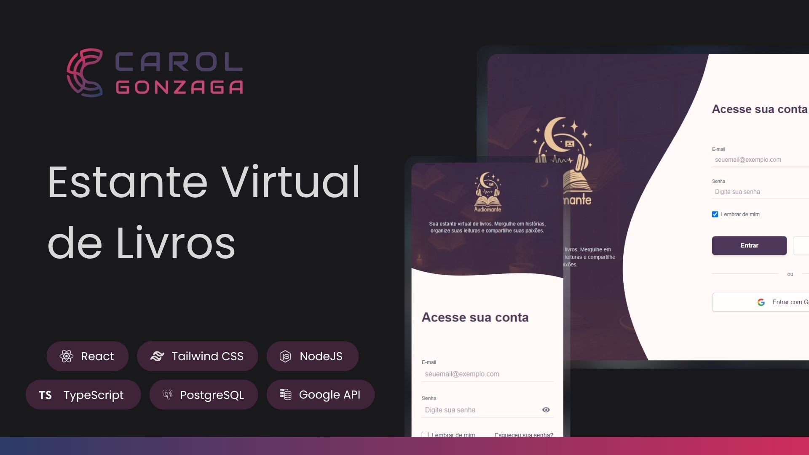

  

 

Uma plataforma full-stack para catalogar e resenhar livros, permitindo que usuários criem sua estante virtual personalizada.

  <a href="#-tecnologias">Tecnologias</a>&nbsp;&nbsp;&nbsp;|&nbsp;&nbsp;&nbsp;
  <a href="#-objetivo">Objetivo</a>&nbsp;&nbsp;&nbsp;|&nbsp;&nbsp;&nbsp;
  <a href="#️-funcionalidades">Funcionalidades</a>&nbsp;&nbsp;&nbsp;|&nbsp;&nbsp;&nbsp;
  <a href="https://projeto-audiomante.vercel.app" target="_blank">Acesse o Projeto</a>

 
 

  

 
 

## 🚀 Tecnologias

Esse projeto foi desenvolvido em um monorepo, separando o `client` (Front-end) e a `api` (Back-end).

### **Front-end (Client)**

-   **React** e **Next.js** com App Router
-   **TypeScript**
-   **Tailwind CSS**
-   **React Context**
-   **Axios**

### **Back-end (API)**

-   **Node.js** e **Express**
-   **TypeScript**
-   **Prisma**
-   **PostgreSQL**
-   **JSON Web Tokens (JWT)**
-   **Passport.js**
-   **Bcrypt.js**

### **Infraestrutura e API Externa**

-   **Vercel**
-   **Google Books API**

 
 

## 🎯 Objetivo

O objetivo principal foi construir uma aplicação full-stack completa e robusta, aplicando conceitos modernos de desenvolvimento, como:

-   **Arquitetura Full-stack:** Criar e integrar uma API RESTful (Node/Express) com um cliente SPA (Next.js).
-   **Autenticação Segura:** Implementar múltiplos métodos de autenticação, incluindo cadastro local com JWT e login social com OAuth 2.0 (Google).
-   **Gerenciamento de DB:** Utilizar o Prisma para modelar, migrar e consultar um banco de dados PostgreSQL de forma segura e tipada.
-   **Estado Global:** Gerenciar o estado de autenticação do usuário no front-end de forma eficiente e centralizada com React Context.
-   **Integração com APIs:** Consumir e processar dados de uma API de terceiros (Google Books API).
-   **Design Responsivo:** Criar uma interface fluida, acessível e adaptável a dispositivos móveis e desktop com Tailwind CSS.
-   **Deploy de Monorepo:** Configurar um pipeline de build e deploy para um projeto monorepo na Vercel, com _rewrites_ de servidor.

 
 

## 🛠️ Funcionalidades

A aplicação permite que o usuário:

-   **Autenticação:** Crie uma conta, faça login com email/senha ou utilize o login social do Google.
-   **Estante Virtual:** Visualize todos os livros adicionados em sua estante pessoal, com estatísticas de leitura (livros lidos, lendo, quero ler e paginômetro).
-   **Busca de Livros:** Pesquise livros globalmente através da integração com a Google Books API.
-   **Descoberta:** Veja uma lista de sugestões de livros pré-selecionados na página de busca.
-   **Gerenciamento de Livros:**
    -   Adicione um livro à sua estante (que é definido com o status padrão "Quero Ler").
    -   Clique em um livro para ver detalhes, como resumo, autor, e número de páginas.
    -   Altere o status de um livro (Quero Ler, Lendo, Lido) a qualquer momento.
    -   Adicione ou edite uma nota (de 0 a 5) e uma resenha escrita para os livros.
    -   Remova um livro da sua estante.
